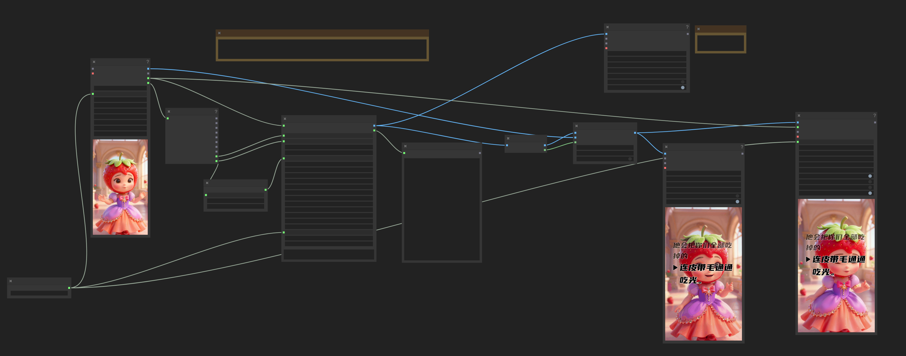
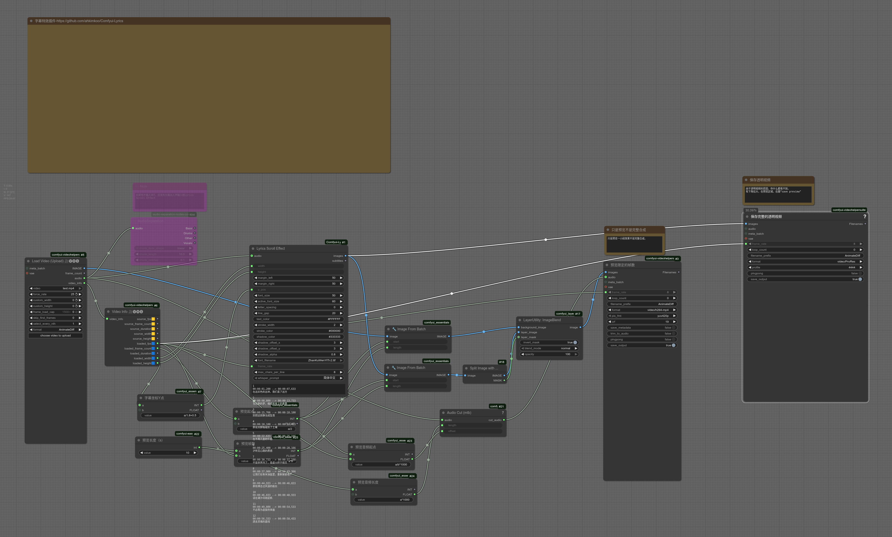

# ComfyUI-Lyrics

A ComfyUI custom node for generating dynamic scrolling lyrics videos with smooth animations. Supports audio-to-text transcription using OpenAI Whisper or importing existing SRT subtitles.

一个用于生成动态滚动歌词视频的 ComfyUI 自定义节点。支持使用 OpenAI Whisper 进行语音转文字，或导入现有的 SRT 字幕。





[效果演示](example/example.mp4)

[工作流下载](example/example-workflow2.json)

🔗 **GitHub Repository**: [https://github.com/ahkimkoo/Comfyui-Lyrics](https://github.com/ahkimkoo/Comfyui-Lyrics)

## ✨ Features (功能特性)

*   **Dynamic Scrolling (动态滚动)**:
    *   Smooth slot-based scrolling animation with Ease-Out cubic curves.
    *   Active line magnification and highlighting.
    *   Automatic "Upcoming" preview logic.
    *   基于槽位的平滑滚动动画，支持焦点行放大高亮，上下行半透明预览。
*   **Audio Transcription (音频识别)**:
    *   Integrated **OpenAI Whisper** for automatic speech-to-text.
    *   Support for `initial_prompt` to guide language style (e.g., Simplified/Traditional Chinese).
    *   集成 OpenAI Whisper，支持自动语音识别生成字幕。支持设置 Prompt 以引导简繁体输出。
*   **SRT Support (字幕支持)**:
    *   Import existing SRT text directly.
    *   Auto-fallback logic: Use text if provided, otherwise transcribe audio.
    *   支持直接输入 SRT 格式文本。智能判断：优先使用文本，若为空则自动识别音频。
*   **Rich Styling (丰富样式)**:
    *   Custom Fonts (support for `models/fonts`).
    *   Text Shadow & Stroke (阴影与描边).
    *   Adjustable Margins & Spacing (边距与行间距).
    *   Dynamic Triangle Indicator (动态三角指示标).
*   **Smart Layout (智能排版)**:
    *   Automatic text wrapping (自动折行).
    *   Dynamic height calculation based on content.
    *   Aligned indentation for list-style look.

## 📦 Installation (安装)

### Method 1: ComfyUI Manager (Recommended)

You can install this node directly via ComfyUI Manager:
1.  Open ComfyUI Manager.
2.  Click "Install Custom Nodes".
3.  Search for `Comfyui-Lyrics`.
4.  Install.

在 ComfyUI Manager 中搜索 `Comfyui-Lyrics` 即可一键安装。

### Method 2: Manual Installation

1.  Navigate to your ComfyUI custom nodes directory:
    ```bash
    cd ComfyUI/custom_nodes/
    ```
2.  Clone this repository:
    ```bash
    git clone https://github.com/ahkimkoo/Comfyui-Lyrics.git
    ```
3.  Install dependencies:
    ```bash
    cd Comfyui-Lyrics
    pip install -r requirements.txt
    ```
    *Dependencies include: `openai-whisper`, `Pillow`, `torchaudio`, `numpy`, `torch`.*

4.  **Optional**: Place your font files (`.ttf`, `.otf`) in `ComfyUI/models/fonts/`. If the directory doesn't exist, create it.
    *   **提示**: 请在 `ComfyUI/models/fonts/` 下放入中文字体文件（如 `msyh.ttf`），否则中文可能无法正确显示。

## 🚀 Usage (使用方法)

Add the node **"Lyrics Scroll Effect"** (Category: `Lyrics`) to your workflow.

### Inputs (输入参数)

*   **width / height**: Video resolution (视频分辨率).
*   **margin_left / margin_right**: Side margins (左右边距). Text width is calculated automatically.
*   **y_pos**: Y-position of the **Active Line** (Center). (焦点行垂直位置).
*   **font_size**: Font size for inactive lines (非焦点行字号). Default: 30.
*   **active_font_size**: Font size for the active line (焦点行字号). Default: 40.
*   **letter_spacing**: Spacing between characters (字间距).
*   **line_gap**: Spacing between lines/items (行间距/项间距). Also applies to wrapped lines.
*   **text_color**: Hex color for text (文字颜色).
*   **stroke_width / stroke_color**: Text outline settings (描边设置).
*   **shadow_color / shadow_offset / shadow_alpha**: Drop shadow settings (阴影设置).
*   **font_filename**: Select font from `models/fonts`.
*   **frame_rate**: Output video frame rate (e.g., 25.0).
*   **whisper_prompt**: Hint for Whisper (e.g., "简体中文", "English"). Controls language style.
*   **audio (Optional)**: Audio input for timing/transcription.
*   **text (Optional)**: SRT format text.

### Logic Priority (逻辑优先级)

1.  **Text Input**: If `text` is connected and not empty, it uses the provided SRT text. Audio is used for duration calculation only.
2.  **Audio Input**: If `text` is empty, it uses `audio` to run Whisper transcription.
3.  **Duration**: Calculated from Audio length (if present) or Subtitle length (if Text only).

## 📄 License

This project is open source.

---
**Created by ahkimkoo**
